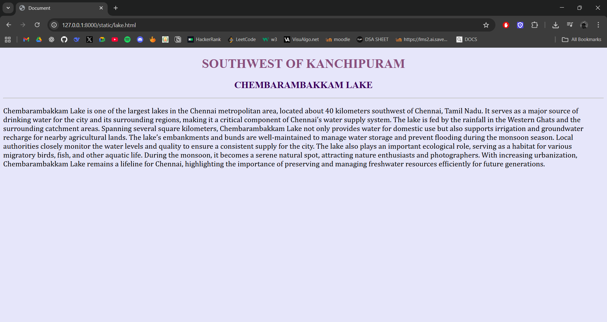

# Ex04 Places Around Me
# Date:28.09.2025
# AIM
To develop a website to display details about the places around my house.

# DESIGN STEPS
## STEP 1
Create a Django admin interface.

## STEP 2
Download your city map from Google.

## STEP 3
Using <map> tag name the map.

## STEP 4
Create clickable regions in the image using <area> tag.

## STEP 5
Write HTML programs for all the regions identified.

## STEP 6
Execute the programs and publish them.

# CODE:
```
map.html:

<!DOCTYPE html>
<html lang="en">

<head>
    <meta charset="UTF-8">
    <meta name="viewport" content="width=device-width, initial-scale=1.0">
    <title>My City</title>
</head>

<body bgcolor="lavender">
    <h1 style="font-family: 'Times New Roman'; color: #8a4f7d; text-align: center;">SOUTHWEST OF KANCHIPURAM</h1>
    <h1 style="font-family: 'Times New Roman'; color: #8a4f7d; text-align: center;">SRIPERUMBUDUR</h1>
    <h2 style="font-family: 'Gill Sans';color: #3a015c;text-align: center;">A.SATHYA NARAYANAN(25016804)</h2>
    <hr>
    <center>
        
        <map name="map">
            <area alt="SRI RAMANUJAR TEMPLE" title="SRI RAMANUJAR TEMPLE" href="temple.html" coords="835,197,979,230"
                shape="rect">
            <area title="Hometown" href="spr.html" coords="885,264,733,234" shape="rect">
            <area title="Chembarambakkam lake" href="lake.html" coords="1246,12,1534,75" shape="rect">
            <area title="santhavelur" href="santhavelur.html" coords="282,443,407,497" shape="rect">
            <area title="sunguvarchatram" href="svc.html" coords="374,392,505,444" shape="rect">

        </map>
    </center>
</body>

</html>

temple.html:

<!DOCTYPE html>
<html lang="en">

<head>
    <meta charset="UTF-8">
    <meta name="viewport" content="width=device-width, initial-scale=1.0">
    <title>Document</title>
    <style>
        p {
            font-size: larger;
            font-family: Cambria, Cochin, Georgia, Times, 'Times New Roman', serif;
        }
    </style>
</head>

<body bgcolor="lavender">
    <h1 style="font-family: 'Times New Roman'; color: #8a4f7d; text-align: center;">SRIPERUMBUDUR</h1>
    <h2 style="font-family: 'Gill Sans';color: #3a015c;text-align: center;">SRI RAMANUJAR TEMPLE</h2>
    <hr>
    <p>Adi Kesava Temple (also called Ramanujar Temple) is dedicated to Hindu god Vishnu located in Sriperumbudur,
        Kanchipuram district, in the South Indian state of Tamil Nadu. Constructed in the Dravidian style of
        architecture, Vishnu, who is worshipped as Adi Kesava, and his consort Lakshmi as Ethiraja Nadhavalli. The
        temple is believed to be the birthplace of Ramanuja, the exponent of Vishishtadvaita philosophy. The gold plated
        shrine in front of the hall of Ramanuja was built by the Maharaja of Mysore. It is considered one among the 108
        Abhimana Kshethram of Vaishnavate tradition.

        The temple is open from 6:30 a.m. to 12 p.m. and 4 p.m. to 8 p.m and has six daily rituals at various times of
        the day. Various festivals are celebrated in the temple, with the Chitirai Brahmotsavam, Masi Pooram festival
        during February - March and Panguni Uthiram festival during March - April being the most prominent. The temple
        is maintained and administered by the Hindu Religious and Endowment Board of the Government of Tamil Nadu.</p>
</body>

</html>

svc.html:

<!DOCTYPE html>
<html lang="en">

<head>
    <meta charset="UTF-8">
    <meta name="viewport" content="width=device-width, initial-scale=1.0">
    <title>Document</title>
    <style>
        p {
            font-size: larger;
            font-family: Cambria, Cochin, Georgia, Times, 'Times New Roman', serif;
        }
    </style>
</head>

<body bgcolor="lavender">
    <h1 style="font-family: 'Times New Roman'; color: #8a4f7d; text-align: center;">SOUTHWEST OF KANCHIPURAM</h1>
    <h2 style="font-family: 'Gill Sans';color: #3a015c;text-align: center;">SUNGUVARCHATRAM</h2>
    <hr>
    <p>
        Sunguvarchatram is a town located in the Kanchipuram district of Tamil Nadu, near Sriperumbudur. It lies along
        the route connecting Sriperumbudur to nearby industrial and residential areas, making it an important transit
        and commercial hub in the region. The town has a mix of rural charm and growing urban development due to its
        proximity to major industrial corridors.

        Sunguvarchatram is known for its local temples, cultural heritage, and community festivals, which reflect the
        traditions of Tamil Nadu. Agriculture plays a role in the surrounding areas, though industrial and commercial
        growth has become increasingly significant. Its location near Sriperumbudur and other major towns provides
        residents easy access to education, healthcare, and transportation facilities.

        The town serves as a connecting point for travelers and pilgrims visiting nearby spiritual sites, including the
        Sri Ramanujar Temple and other local shrines. Sunguvarchatram continues to grow steadily while maintaining its
        cultural and social identity, making it a notable location in the Kanchipuram district both for residents and
        visitors.
    </p>
</body>

</html>

spr.html:

<!DOCTYPE html>
<html lang="en">

<head>
    <meta charset="UTF-8">
    <meta name="viewport" content="width=device-width, initial-scale=1.0">
    <title>Document</title>
    <style>
        p {
            font-size: larger;
            font-family: Cambria, Cochin, Georgia, Times, 'Times New Roman', serif;
        }
    </style>
</head>

<body bgcolor="lavender">
    <h1 style="font-family: 'Times New Roman'; color: #8a4f7d; text-align: center;">SRIPERUMBUDUR</h1>
    <h2 style="font-family: 'Gill Sans';color: #3a015c;text-align: center;">HOMETOWN</h2>
    <hr>
    <p>Sriperumbudur is a historic town located in the Kanchipuram district of Tamil Nadu, India, about 40 kilometers
        southwest of Chennai. It is famously known as the birthplace of the great 11th-century philosopher and
        theologian, Sri Ramanuja, a key proponent of the Sri Vaishnavism tradition. The town attracts thousands of
        pilgrims and visitors every year due to its religious and cultural significance.

        The Sri Ramanujar Temple in Sriperumbudur is a major landmark, dedicated to the teachings and legacy of Sri
        Ramanuja. The temple architecture reflects traditional Dravidian styles, with intricately carved pillars,
        gopurams (towering gateways), and sanctums. Festivals and religious ceremonies here are celebrated with
        grandeur, drawing devotees from across the country.

        Apart from its spiritual importance, Sriperumbudur is also a site of historical and modern significance. It has
        grown as an industrial hub, hosting several multinational companies, while retaining its cultural heritage. The
        town’s serene environment, coupled with its religious landmarks, makes it an ideal place for both pilgrimage and
        learning.

        Visiting Sriperumbudur offers a blend of devotion, history, and cultural richness, making it a prominent
        destination in Tamil Nadu for spiritual seekers and tourists alike.</p>

</body>

</html>

santhavelur.html:

<!DOCTYPE html>
<html lang="en">

<head>
    <meta charset="UTF-8">
    <meta name="viewport" content="width=device-width, initial-scale=1.0">
    <title>Document</title>
    <style>
        p {
            font-size: larger;
            font-family: Cambria, Cochin, Georgia, Times, 'Times New Roman', serif;
        }
    </style>
</head>

<body bgcolor="lavender">
    <h1 style="font-family: 'Times New Roman'; color: #8a4f7d; text-align: center;">SOUTHWEST OF KANCHIPURAM</h1>
    <h2 style="font-family: 'Gill Sans';color: #3a015c;text-align: center;">SANTHAVELUR</h2>
    <hr>
    <p>
        Santhavelur is a village located near Sriperumbudur in Tamil Nadu, India. It is part of the Kanchipuram district
        and lies close to several industrial and residential developments, making it an area of both cultural and
        economic significance. The village is known for its traditional Tamil heritage and local temples that reflect
        the region’s spiritual and architectural history.

        Santhavelur benefits from its proximity to Sriperumbudur and the Chennai metropolitan area, providing access to
        educational institutions, markets, and transportation facilities. Agriculture remains an important activity
        here, with the surrounding lands supporting crops like rice, vegetables, and other local produce.

        The community in Santhavelur is close-knit, often participating in local festivals and cultural events. Its
        serene environment, combined with traditional customs, makes it a representative example of rural life in Tamil
        Nadu, while also witnessing gradual modernization due to nearby industrial growth.
    </p>
</body>

</html>

lake.html:

<!DOCTYPE html>
<html lang="en">
<head>
    <meta charset="UTF-8">
    <meta name="viewport" content="width=device-width, initial-scale=1.0">
    <title>Document</title>
    <style>
        p{
            font-size: larger;
            font-family:Cambria, Cochin, Georgia, Times, 'Times New Roman', serif;
        }
    </style>
</head>
<body bgcolor="lavender">
    <h1 style="font-family: 'Times New Roman'; color: #8a4f7d; text-align: center;">SOUTHWEST OF KANCHIPURAM</h1>
    <h2 style="font-family: 'Gill Sans';color: #3a015c;text-align: center;">CHEMBARAMBAKKAM LAKE</h2>
    <hr>
    <p>
        Chembarambakkam Lake is one of the largest lakes in the Chennai metropolitan area, located about 40 kilometers southwest of Chennai, Tamil Nadu. It serves as a major source of drinking water for the city and its surrounding regions, making it a critical component of Chennai’s water supply system. The lake is fed by the rainfall in the Western Ghats and the surrounding catchment areas.

Spanning several square kilometers, Chembarambakkam Lake not only provides water for domestic use but also supports irrigation and groundwater recharge for nearby agricultural lands. The lake’s embankments and bunds are well-maintained to manage water storage and prevent flooding during the monsoon season. Local authorities closely monitor the water levels and quality to ensure a consistent supply for the city.

The lake also plays an important ecological role, serving as a habitat for various migratory birds, fish, and other aquatic life. During the monsoon, it becomes a serene natural spot, attracting nature enthusiasts and photographers. With increasing urbanization, Chembarambakkam Lake remains a lifeline for Chennai, highlighting the importance of preserving and managing freshwater resources efficiently for future generations.
    </p>    
</body>
</html>

```
# OUTPUT





# RESULT
The program for implementing image maps using HTML is executed successfully.
